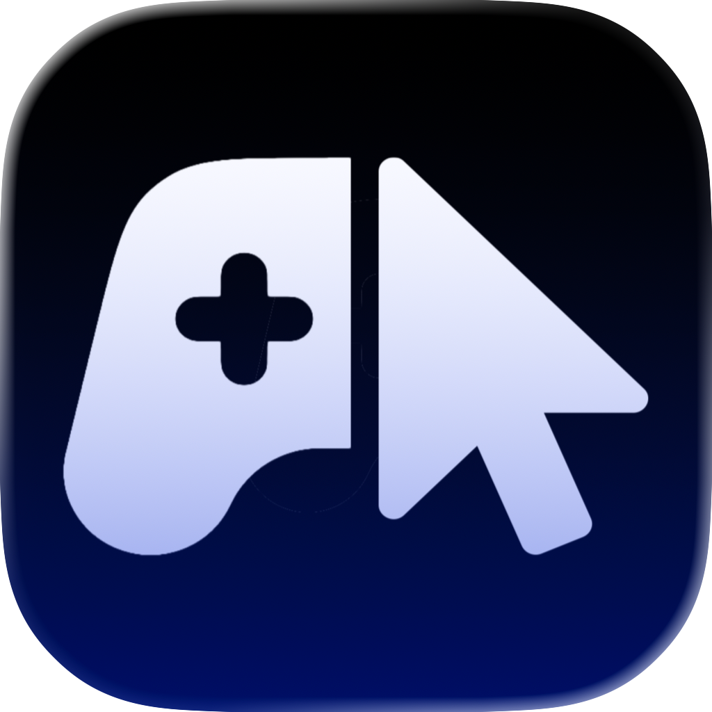

<p align="center">
  
</p>

<h1 align="center">Click Play</h1>

<p align="center">
  <em>Click Play to start.</em>
</p>

<p align="center">
  A macOS gamepad overlay for playing many keyboard-driven games with just your mouse.
</p>

<p align="center">
  If Click Play helps you, leaving a star is greatly appreciated.
</p>

## Table of Contents

- [Introduction](#introduction)
- [Installation](#installation)
- [Getting Started](#getting-started)
- [Full Documentation](#full-documentation)
- [Features](#features)
- [Caveats](#caveats)
- [Contributing](#contributing)
- [Support This Project](#support-this-project)
- [AI Disclosure](#ai-disclosure)
- [License](#license)

## Introduction

Click Play puts an always-on-top gamepad on your screen. Click buttons with your mouse, and Click Play sends the matching keyboard inputs to the app or game you are playing.

It is built for games and workflows where a mouse-accessible overlay can stand in for keyboard controls. You can keep the game focused, place the gamepad where it works best, and customize layouts for different games.

<p align="center">
  <video src="img/ClickPlay_sizzlereel.mp4" width="500" controls></video>
</p>

## Installation

1. Download the latest release from [GitHub Releases](https://github.com/TheOPBunny/ClickPlay/releases).
2. Unzip the `.zip`.
3. Drag **Click Play** into your **Applications** folder.
4. Open **Click Play**.
5. If macOS shows a security warning, click **Done**.
6. Open **System Settings** > **Privacy & Security**, scroll to the bottom, then choose **Open Anyway** for Click Play.
7. Confirm **Open Anyway** when macOS asks.

Click Play is distributed outside the Mac App Store, so the first launch may require the extra macOS confirmation step.

## Getting Started

Click Play needs Accessibility permission so it can send keyboard inputs to other apps on your behalf. On first launch, Click Play will guide you to the right macOS settings screen.

After permission is granted:

1. Use the menu bar icon to show or hide the gamepad.
2. Click or hold a gamepad button to send its assigned input.
3. Open the editor from the menu bar or the gamepad menu with **Open Editor...**.
4. Create or switch profiles for different games and layouts.

Profiles are saved locally in:

```text
~/Library/Application Support/Click Play/profiles.json
```

## Full Documentation

For a complete feature guide, codebase tour, build notes, planned features, and FAQ, see [Click Play Documentation](docs/index.md).

## Features

- Always-on-top overlay that stays available while another app remains focused.
- Clickable buttons that map to keyboard input.
- Multiple profiles for different games or control schemes.
- Layered profiles for switching between related layouts.
- Joystick-style controls with directional key bindings.
- Customizable button position, size, label, color, shape, and interaction mode.
- Support for keyboard bindings, system events, right-click inputs, toggles, and turbo-style interactions.
- Profile and template editing through the built-in Click Play Editor.

More documentation is planned as the project matures.

## Caveats

Click Play is still a prototype, and some limitations are expected:

- Games that capture the mouse may not work well with Click Play.
- Input latency can be noticeable in some games and is still being investigated.
- Fast-paced games and games that require many simultaneous inputs can be difficult to play with only a mouse.
- Keyboard injection requires macOS Accessibility permission.
- The current input approach requires the App Sandbox to remain disabled.

## Contributing

Issues, ideas, and pull requests are welcome. This project is evolving quickly, so small, focused contributions are easiest to review.

For code changes, please preserve the core behavior that makes Click Play useful:

- The gamepad must remain usable while another app or game stays focused.
- Button press, hold, and release behavior should stay reliable.
- Saved profiles should remain backward compatible unless a migration is intentional.

## Support This Project

[](https://ko-fi.com/N4N71ZKCBA)

Your support goes directly toward development of Click Play, including:

- Apple Developer Program membership.
- Hardware for future Windows work.
- Development tooling and AI-assisted coding costs.

## AI Disclosure

Click Play is developed with AI-assisted tooling, including Codex. AI is used to help draft, refactor, debug, and document parts of the project, but project decisions and shipped changes are reviewed and owned by me.

## License

Click Play is licensed under the [Apache License 2.0](LICENSE).
