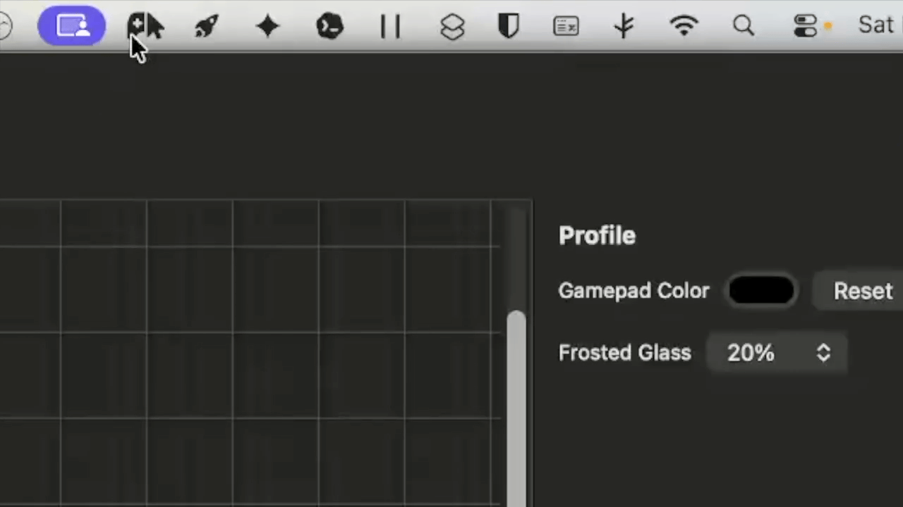
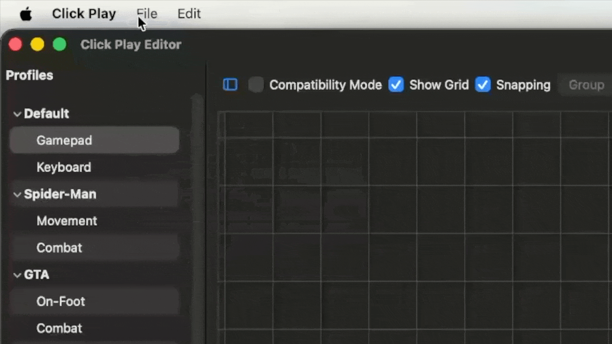
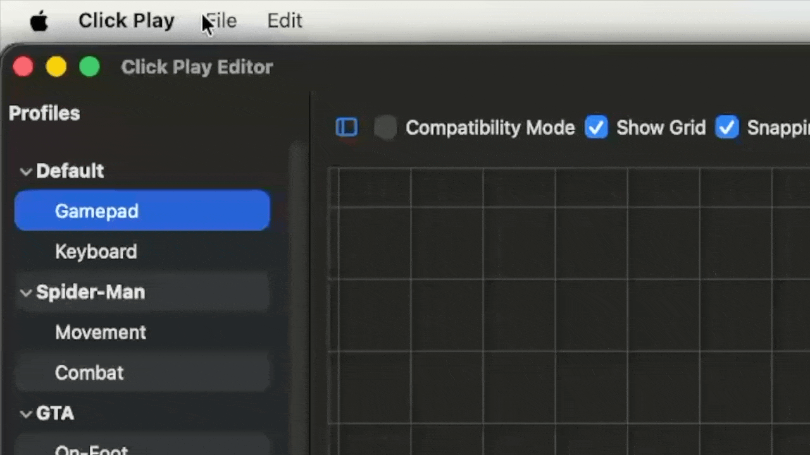
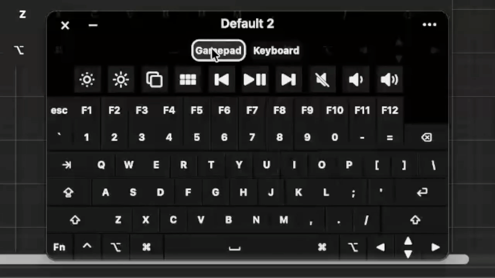

# Click Play Documentation

Click Play is a macOS mouse-driven gamepad and control overlay for keyboard-driven games and workflows. It gives users a customizable on-screen control surface while keeping the target app or game focused.

## Table of Contents

- [About the Project](#about-the-project)
- [Features](#features)
- [Codebase](#codebase)
- [Planned Features and Ideas](#planned-features-and-ideas)
- [FAQ](#faq)

## About the Project

Click Play runs as a macOS status-bar app. Its main experience is an always-on-top, non-activating overlay that can sit above games or other apps without taking focus away from them.

Users build profiles made of buttons, joystick controls, layers, templates, colors, labels, and bindings. Those controls can inject keyboard events, trigger supported system events, switch layers, or behave as toggle/turbo controls.

The app is currently a functional prototype that is growing into a richer editor-backed control system. It uses AppKit for lifecycle, status-bar, windowing, editor, and overlay behavior, with SwiftUI used where it fits well.

Click Play uses `CGEvent` for keyboard injection. That means macOS Accessibility permission is required, and the App Sandbox must remain disabled for the current input approach.

## Features

### Menu Bar

The menu-bar item provides entry points for showing or hiding the gamepad, opening the editor, checking for updates, switching profiles, and opening Accessibility settings.

<p align="center">
    
</p>

### Gamepad Overlay

This is how you play games with Click Play. The overlay reads your profiles and turns them into an interactive gamepad with the customizable buttons and virtual joysticks you configured. The header lets you close or minimize the gamepad and open a drop-down menu where you can:

- Change profiles.
- Change gamepad overlay transparency.
- Set the fade timer.
- Open the editor.

#### Always-On-Top Overlay

The gamepad is displayed in a borderless overlay panel above normal app windows. It is designed to remain usable while another app or game stays focused.

#### Non-Activating Window Behavior

The overlay is intentionally non-activating: interacting with Click Play should not make the overlay the key or main window. This is central to using it over games and other focused apps. Put simply, interacting with Click Play does not steal focus from the game, and clicks do not pass through the gamepad window, so you do not unintentionally send inputs in-game.

#### Transparency and Fade

You can control transparency from the gamepad overlay's menu. Transparency is stored per profile or layer.

A global fade timeout can fade the overlay after inactivity, with menu options such as never, 3 seconds, 5 seconds, 10 seconds, and 30 seconds.

#### Show Pointer Location

The gamepad overlay can show a pointer ring where the mouse is located on the overlay. This can be useful for games that hide the mouse. 

It can be toggled from the gamepad overlay's drop-down menu and is saved per profile.

### Virtual Cursor Mode

Virtual Cursor Mode lets you control the gamepad overlay with mouse movement, clicks, and scrolling while the physical pointer stays in place. This can be useful with games that capture the mouse or restrict mouse movements.

To make it available for a profile, open **Profile Settings** in the editor, enable **Virtual Cursor Mode**, and save the profile. You can also set the activation delay and temporary release duration there.

Use the lock button in the gamepad header to start Virtual Cursor Mode. A countdown gives you time to prepare before mouse input is captured. The virtual pointer starts at the physical pointer when it is over the overlay, or in the center of the gamepad otherwise.

While Virtual Cursor Mode is active:

- Mouse movement moves the virtual pointer around the overlay.
- Left click, right click, and scrolling are sent to the control under the virtual pointer.
- The temporary release button in the header (lock icon with clock) returns normal mouse control for the configured amount of time. Click it again to resume immediately.
- Press the unlock button in the header to exit Virtual Cursor Mode.
- As a failsafe, press **Escape** five times, with no more than two seconds between presses, to exit Virtual Cursor Mode.

### Click Play Editor

The Click Play Editor is used to create, arrange, configure, duplicate, delete, and save profiles, layers, buttons, groups, and templates. It has a profile sidebar, live preview canvas, and inspector panel. You can open the editor from either the menu bar or the gamepad overlay's menu.

### Profile Settings

The **Profile Settings** button in the editor's top toolbar opens settings for the selected profile. This popover contains Compatibility Mode, gamepad color, frosted glass intensity, and Virtual Cursor Mode settings.

### Profiles

Profiles store complete gamepad layouts. A profile includes pad dimensions, background styling, opacity, compatibility mode, button ordering, button configs, groups, and nested layers.

To create a profile, go to **File** > **Add Profile** or **File** > **Add Profile from Template**.

<p align="center">
    
</p>

You can rename, rearrange, cut, copy, paste, and delete profiles from the profile panel.

Click Play comes preloaded with a basic profile to help you get started.

Profiles are saved locally in:

```text
~/Library/Application Support/Click Play/profiles.json
```

### Layers

Layers are nested profiles inside a top-level profile. They let you switch between related control schemes without leaving the parent profile. For example, you can have one layer for movement and another for combat, then switch between them without going through a menu.

You can rename, rearrange, cut, copy, paste, and delete layers from the profile panel.

To add a layer, go to **File** > **Add Layer** or **File** > **Add Layer from Template**.

<p align="center">
    
</p>

#### Layer Switches

Special layer-switch controls can activate a nested layer from the overlay.

<p align="center">
    
</p>

### Templates

You can save profiles, layers, or button groups as templates. Built-in templates provide starter layouts, and you can create your own reusable templates. You can add profile or layer templates as described above, or create new ones with **File** > **Save Current as Template**, which saves the currently selected profile or layer as a template.

You can rename or delete templates with **File** > **Manage Templates**.

Templates are saved locally in:

```text
~/Library/Application Support/Click Play/templates.json
```

### Preview Canvas

The editor preview canvas renders the gamepad controls and supports selecting, dragging, resizing, grouping, snapping, and alignment. You can toggle a grid over the canvas from the editor's top toolbar.

### Grouping, Snapping, and Alignment

The editor supports button grouping, group color changes, snapping, alignment commands, distribution commands, equal sizing, and marquee selection.

#### Grouping

Select multiple controls to group them. Once grouped, they move and resize together. You can also change the color of every control in the group from the inspector panel. Controls can still be edited by double-clicking them in the canvas. You can save groups as templates to reuse across profiles.

Grouping controls are in the editor’s top toolbar.

You can add a saved group from the **Add...** drop-down in the top-right of the editor. Once a group is added, click it to edit its properties in the inspector panel.

#### Snapping

With snapping enabled, you can line up controls more easily. You can enable snapping in the editor's top toolbar.

#### Alignment

Drag on the canvas to select multiple controls. Once selected, go to the **Edit** menu to choose alignment and spacing options.

### Button Customization

Buttons can be assigned keys, positioned, resized, labeled, colored, styled, and given different shapes. Button labels can have custom size, bold or italic styling, and color.

You can add a button from the **Add...** drop-down in the top-right of the editor. Once a button is added, click it to edit its properties in the inspector panel.

### Key Recording

The editor includes a key recorder for capturing keyboard bindings. It supports ordinary keys, modifier keys, and key combos.

To record a key or combo, click the recorder box to start recording, press any key or combo with your keyboard, then click the recorder box again to stop recording. Press **Clear** to unassign recorded keys.

If you are unable to use a hardware keyboard, you can use macOS's built-in Accessibility Keyboard to record keys.

### Combos

Buttons can use key combo bindings. Key combo activation can be sequential or simultaneous depending on the configuration in the inspector.

- Sequential: keys are sent in order, one at a time.
- Simultaneous: all recorded keys are sent at the same time.

### Right-Click Inputs

Buttons can have separate right-click bindings and interaction modes. If configured, a separate key recorder will become available. If no right-click binding is set, a button can fall back to its primary left-click binding.

### Momentary Press/Hold/Release

For momentary controls, mouse down maps to key down and mouse up or drag-off maps to key up. This release behavior protects against stale held keys.

### Toggle-Hold Mode

Toggle-hold controls let a click toggle an input between held and released states. A button has a red outline when it is in this state.

### Turbo Mode

Turbo controls repeatedly activate an input while active. This is useful for games that benefit from repeated inputs. A button has a green outline when it is in this state.

When an input uses Turbo mode, the inspector shows a rate setting from 1 to 30 clicks per second. Turbo rates can be configured separately for primary button inputs, right-click inputs, and joystick click or scroll inputs.

### Compatibility Mode

Compatibility Mode makes the `keyDown` state last for a minimum of 33 ms. This helps games accept inputs by keeping `keyDown` inside the game's input polling range. It can be useful if your mouse sends very short clicks that cause games to ignore inputs. This usually should not be an issue with standard hardware mice, but it can help with specialty mice, such as the Permobil Bluetooth mouse feature in some wheelchairs.

### Joystick Controls

Joystick-style controls map directional movement to directional key bindings. Each direction can be mapped to any key. Joysticks support capture-style and click-drag interaction modes.

- Capture: left-click a joystick to enter joystick mode. Your mouse will be captured, and all movement will be mapped to the joystick. To release the mouse and leave joystick mode, right-click. Use this mode if you have a joystick-style mouse or are unable to click and hold the left mouse button for a longer duration.
- Click-drag: click and drag anywhere on the joystick surface for directional inputs. This is the default mode.

You can add a joystick from the **Add...** drop-down in the top-right of the editor. Once a joystick is added, click it to edit its properties in the inspector panel.

The joystick inspector includes a **Release Delay** setting from 0 to 1000 milliseconds. Newly needed direction keys are pressed immediately, while direction keys that are no longer needed are released after this delay. Shared keys stay held during diagonal changes, so moving from `W` to `W+A` presses only `A`. Leaving joystick control, hiding the overlay, or reloading a profile still releases all held directions immediately.

### Nested Joystick Layers

Each joystick can contain up to five layers with separate direction, click, and scroll bindings. Use the **Layer** drop-down in the joystick inspector to configure the base layer and any nested layers.

Set a supported click or scroll action to **Nested Joystick** to move to the next configured joystick layer. While using capture mode, right-click returns to the previous joystick layer. Right-click releases the mouse after you return to the base layer.

### Joystick Capture HUD

When a joystick enters capture mode, the overlay centers that joystick and shows a HUD with its current layer, direction bindings, and click and scroll actions. Active directions and actions are highlighted so you can see what the joystick is sending without leaving capture mode.

### Joystick Axis and Scroll Behavior

- Axis Lock: keep the joystick held in one direction without continuous input.
- Scroll wheel: use the scroll wheel to toggle axis lock in the up or down direction.
- Hold direction: keep the joystick held in a single direction for a configurable amount of time to axis lock in that direction. Move the joystick again to unlock.
- Off: disable axis lock.
- Scroll Wheel: if not used for axis lock, scroll up and scroll down can be assigned a key or combo. If configured, a separate key recorder will become available.

### System Events

Buttons can trigger supported system events, including brightness, volume, media, Launchpad, and Mission Control actions.

You can add a system event from the **Add...** drop-down in the top-right of the editor. Once a system event button is added, click it to edit its properties in the inspector panel.

### Dwell Actions

Dwell Action buttons let you activate mouse actions by resting the pointer in one place instead of physically clicking. They can perform left click, double click, right click, middle click, left/right/middle hold actions, and scroll up or down.

You can add a Dwell Action from the **Add...** drop-down in the top-right of the editor. Once a Dwell Action button is added, click it to edit its properties in the inspector panel.

Dwell Action buttons behave like toggles. Only one Dwell Action can be active at a time, and the active one is shown with a blue outline. Clicking the active Dwell Action again turns it off.

When a Dwell Action is active, Click Play watches global pointer movement. After the pointer moves beyond the configured movement tolerance and then stays still for the configured timer duration, the selected action activates. If the pointer moves beyond tolerance before the timer completes, the timer cancels and waits for the pointer to become stationary again.

For hold actions, the first completed dwell presses and holds the selected mouse button. After the pointer moves again and completes another dwell, Click Play releases the held button. Physical mouse clicks, overlay hide, minimize, profile reload, or quitting the app release any held dwell button.

The inspector lets you configure:

- Action type.
- Timer duration in seconds.
- Movement tolerance in pixels.
- Icon size.

A small progress bar appears under the cursor while a dwell timer is running. Dwell Actions continue working even when the overlay fades, so the fade behavior remains visual-only.

### Update Checks

Click Play checks GitHub Releases for the latest version. Updates are checked automatically once per day, or you can check manually from the menu bar item.

### Caveats

~~Games that capture the mouse may not work well with Click Play. The only workaround I have found so far is to play in a Parallels VM with the "Don't optimize for games" mouse setting, but that is very demanding on the system and performance takes a hit. A Parallels subscription is also required.~~
Virtual Cursor Mode fixed this for every game I tested.

Input latency can vary by game and system. In my most recent test, I measured about the same amount of latency as a DualShock 4 over Bluetooth, so you may not notice any. Let me know what it feels like for you; I will keep trying to improve it as much as I can.

Because keyboard injection uses `CGEvent`, Accessibility permission is required, and App Sandbox must remain disabled for the current implementation.

## Codebase

### Project Layout

- `Click Play.xcodeproj/`: Xcode project, workspace metadata, and shared scheme.
- `ClickPlay/`: main macOS app source, AppKit windows/controllers/views, SwiftUI onboarding/update views, entitlements, Info.plist, and app icon metadata.
- `ClickPlayShared/`: shared profile, template, persistence, and button identity models.
- `Media.xcassets/`: onboarding videos and menu bar/logo assets.
- `docs/`: Documentation and repo image assets.
- `README.md`: concise public landing page and quick-start guide.
- `LICENSE`: Apache License 2.0.
- `AGENTS.md`: contributor and agent instructions for safe development.

### How to Build

Open `Click Play.xcodeproj` in Xcode and build the `Click Play` scheme, or run:

```sh
xcodebuild -project "Click Play.xcodeproj" -scheme "Click Play" -configuration Debug build
```

To get the app bundle from Xcode, go to **Product** > **Archive** > **Distribute App** > **Custom** > **Copy App**.

Project facts:

- App target and scheme: `Click Play`
- Build configurations: `Debug`, `Release`
- macOS deployment target: `13.0`
- Bundle identifier: `com.TheOPBunny.ClickPlay`
- Signing: Apple Development signing is configured in the project
- Sandbox: App Sandbox must stay disabled for the current `CGEvent` injection approach

For reliable Accessibility/TCC behavior during development, use a stable signed app identity and run the same signed app path between launches.

### File Guide

#### `ClickPlay/main.swift`

The AppKit entry point. It creates the `AppDelegate`, assigns it to `NSApplication.shared.delegate`, and starts `NSApplicationMain`.

#### `ClickPlay/AppDelegate.swift`

Coordinates app lifetime, menu setup, status-bar behavior, Accessibility permission flow, onboarding, update checks, gamepad launch/show/hide, profile switching, editor launch, and editor command forwarding.

#### `ClickPlay/GamepadWindow.swift`

Defines the borderless non-activating `NSPanel` that hosts the gamepad. It owns overlay visibility, resize constraints, minimize state, opacity, inactivity fade behavior, global mouse monitoring, and profile reloads.

#### `ClickPlay/GamepadContentView.swift`

Hosts the translucent HUD, header controls, menu button, minimize/hide controls, background tint/blur, empty-space dragging, profile-based button layout, Virtual Cursor Mode routing, and joystick capture HUD and visibility behavior.

#### `ClickPlay/GamepadButtonView.swift`

Draws and handles one live overlay control. It manages mouse events, hover/pressed visuals, keyboard actions, system events, sub-profile switches, right-click input, joystick capture and nested layers, axis lock, scroll actions, toggle-hold, configurable turbo input, sequential bindings, simultaneous bindings, and release cleanup.

#### `ClickPlay/VirtualCursorModeController.swift`

Coordinates Virtual Cursor Mode activation, countdowns, temporary release, emergency Escape handling, and global mouse event routing while the mode is active.

#### `ClickPlay/KeyInjector.swift`

Serializes low-level keyboard injection through `CGEvent`. It tracks logical bindings and physical key ownership so duplicate key-downs are avoided and overlapping controls do not release each other's keys too early.

#### `ClickPlay/EditorWindowController.swift`

Owns the editor `NSWindow`, persists its frame, handles close/save confirmation, activates the editor app when shown, and forwards menu/status-bar commands into the editor controller.

#### `ClickPlay/EditorViewController.swift`

Builds the editor shell with a profile sidebar and button editor. It manages split-view layout, sidebar collapse persistence, profile selection, editor refreshes, save confirmation, and high-level add/remove/template commands.

#### `ClickPlay/ProfileListViewController.swift`

Controls the profile/layer sidebar. It supports selection, inline rename, drag/drop ordering, context menus, copy/paste, duplicate, delete, undo/redo, creating profiles/layers from templates, saving templates, and managing templates.

#### `ClickPlay/ButtonEditorViewController.swift`

Implements the main profile layout editor. It owns the preview canvas, profile settings popover, inspector panel, editable profile copy, selected buttons/groups, clipboard, snapping, alignment/distribution/equalize commands, undo, dirty-state prompts, workspace sizing, and save behavior.

#### `ClickPlay/ButtonDetailPanel.swift`

Implements the inspector UI for selected buttons, selected groups, key bindings, right-click input, turbo rates, joystick layers and settings, system events, label style, shape, color, size, and delete actions.

#### `ClickPlay/GamepadPreviewView.swift`

Renders the editor canvas and handles direct manipulation. It draws buttons, groups, selection handles, alignment guides, and marquee selection, and reports normalized geometry changes back to the editor.

#### `ClickPlay/KeyRecorderButton.swift`

Reusable AppKit key recorder used by the inspector. It captures key-down and modifier-change events, records multiple bindings, supports modifier-only bindings, and displays the captured binding list.

#### `ClickPlay/FirstRunOnboardingView.swift`

SwiftUI onboarding flow shown before Accessibility permission is granted. It displays intro screens, loops bundled videos, and exposes actions for learning more or requesting permission.

#### `ClickPlay/UpdateChecker.swift`

Fetches the latest GitHub Release, parses version tags, compares them against the app version, and throttles automatic update checks through `UserDefaults`.

#### `ClickPlay/UpdateCheckView.swift`

SwiftUI update-check UI and view model. It displays checking, update available, up-to-date, and failure states, with actions to retry, dismiss, or open the release page.

#### `ClickPlay/SidebarToggleButton.swift`

Small reusable AppKit button that draws a native-looking split-view sidebar glyph for left or right sidebars.

#### `ClickPlay/DebugLog.swift`

Debug and latency logging helpers used throughout the app to keep diagnostic logging consistent.

#### `ClickPlay/Info.plist`

App metadata plist. It uses build settings such as the bundle identifier and app category values from the Xcode project.

#### `ClickPlay/ClickPlay.entitlements`

Entitlements file for the app target. The current injection approach requires App Sandbox to remain disabled.

#### `ClickPlay/ClickPlay.icon/`

Icon metadata and SVG source used by the app icon tooling.

#### `ClickPlayShared/KeyMapping.swift`

Defines `GamepadButton`, the stable button identity used as profile storage keys. It includes legacy/template buttons, generated button IDs, and generated sub-profile switch IDs.

#### `ClickPlayShared/Profile.swift`

Defines the persisted profile model and related types: button config, button actions, interaction modes, turbo configuration, joystick layers and config, Virtual Cursor Mode settings, system events, groups, sizing, coordinates, defaults, color helpers, profile normalization, and default templates.

#### `ClickPlayShared/ProfileStore.swift`

Owns profile and template persistence. It loads/saves JSON files, migrates from the legacy support directory when needed, resolves active profiles/layers, provides built-in templates, and exposes profile/layer/template mutation APIs.

#### `Media.xcassets`

Asset catalog containing first-run intro videos and image assets such as menu bar and logo variants.

#### `docs/img/ClickPlay.png`

README and documentation image for the Click Play logo/preview.

#### `Click Play.xcodeproj`

Xcode project files, workspace metadata, and shared scheme for the `Click Play` app target.

## Planned Features and Ideas

Some of these are early ideas and have not reached the planning phase yet, so I cannot guarantee if or when they will be implemented.

- UI overhaul for the Click Play Editor.
- Continue investigating and reducing input latency where possible.
- Add richer demo media and more complete user-facing docs as the project matures.
- Improve release packaging, signing, and first-launch polish.
- Add more built-in templates for common game/control styles.
- Explore future platform work, including possible Windows support.
- Controller emulation. This may be possible, but the hard part would be getting entitlements from Apple for CoreHID or IOKit. Without the entitlement, there is no feasible way to ship this feature.
- Built-in mouse dwell features.
- Compatibility chart.
- Voice controls.

## FAQ

### What is Click Play for?

Click Play is for games and workflows where a mouse-accessible overlay can stand in for keyboard controls. It is especially useful when you want custom on-screen controls while another app or game remains focused.

### Why develop for macOS instead of Windows or Linux, where gaming is more prevalent?

Good question. macOS's built-in accessibility features are much more developed than other platforms and have enabled me to use a computer. That is why Click Play is developed for macOS first: it is the platform I can use most easily.

### Why use Click Play instead of macOS's Accessibility Keyboard?

The Accessibility Keyboard is very powerful, but it is a keyboard first and does not have dedicated gaming features. Click Play draws heavy inspiration from the Accessibility Keyboard while keeping a focus on gaming and adding relevant features.

### What is the difference between a profile and a layer?

A profile is a top-level layout. A layer is a nested layout inside a profile that can be switched to from the overlay.

### What is the difference between a template and a profile?

A profile is an active saved layout. A template is reusable saved content that can create new profiles, layers, or groups.

### Why do some games not work well?

Games that aggressively capture the mouse or block synthetic input may not cooperate with Click Play. Fast-paced games can also expose latency or simultaneous-input limits.

### Does Click Play have tests?

There is currently no separate test target in the project. For now, validation is mostly build checks plus manual verification of overlay, input, editor, profile, template, joystick, and permission behavior.
